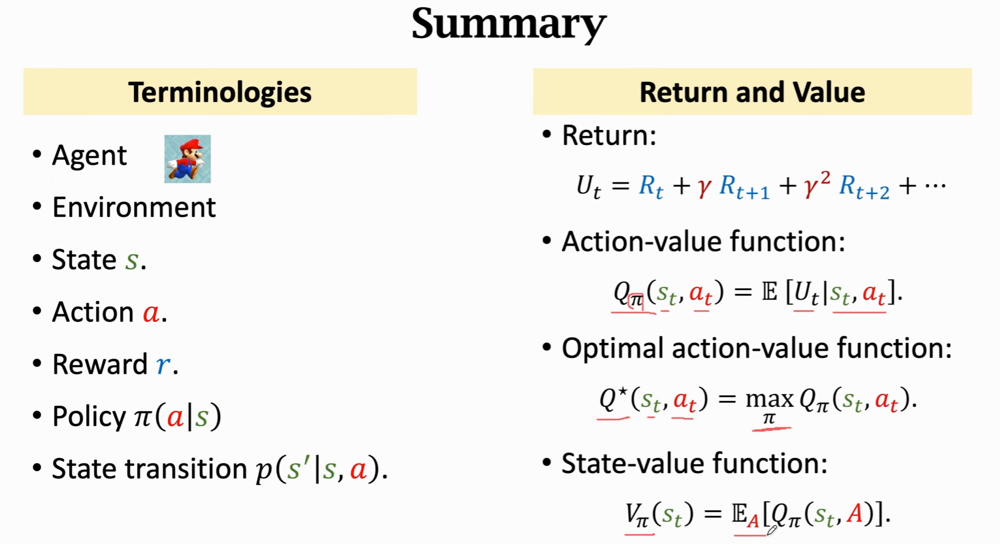

# 01_基本概念 🤖

深度强化学习的目标是学习以下两者之一：
- 🎯 **Policy 函数** π(a|s)  
- 🏆 **最优动作价值函数** Q\*(s, a)  

只要学到其中之一，就可以自动控制 Agent 玩游戏：

- 如果知道 **Policy 函数** π(a|s)，就能把状态 s 作为输入，算出每一个动作的概率，然后随机抽样得到动作 a。  
- 如果知道 **Q\*(s, a)**，就能评估当前状态下每一个动作的好坏，从而选择 q 值最高的动作。  
  - 例如：如果“向上跳”的动作 q 值最高，Agent 就应该向上跳。  

> ✅ **结论**: The Agent can be controlled by either π(a|s) or Q\*(s, a).

---

## 📊 Value Functions

### 1. Action-value function (Q 函数)
- 定义：  
  $Q{_π}(s_t, a_t) = E[U_t | S_t = s_t, A_t = a\_t]$
  其中 U\_t 是未来所有奖励的加权和。

- 特点：
  - 🔗 与 **policy π** 有关
  - 🗺️ 与 **状态 s\_t** 有关
  - 🎬 与 **动作 a\_t** 有关

- 作用：  
  $Q_π(s_t, a_t) 表示在状态 s_t 下采取动作 a_t 是否明智，可以为动作 a_t$ 打分。⭐

---

### 2. State-value function (V 函数)
- 定义：  
  $V_π(s) = E_A[Q_π(s_t, A)], 其中 A ~ π(.|s_t)$

- 离散型：  
  $V_\pi(s_t) = \sum_{a} \pi(a|s_t) \cdot Q_\pi(s_t, a)$

- 连续型：  
  $V_\pi(s_t) = \int \pi(a|s_t) \cdot Q_\pi(s_t, a) \, da$

- 特点：
  - 🔗 只和 **policy π** 与 **状态 s** 有关
  - 与具体动作 a 无关

- 作用：
  - 🧐 V\_π(s) 可以评价当前状态的好坏（快赢了/快输了）
    - 如果 policy π 固定, 那么 s 越好，V\_π(s) 的值就越大.
  - 📈 V\_π(s) 还能评价 **policy π 的好坏**：  
    - 当状态确定, 若 π 越好，E\_S[V\_π(S)] 的平均值就越大.

---

---

## ⚙️ 强化学习方法

### 1. 价值学习 (Value-based learning)
- 🧠 使用 **DQN** 近似 Q\*(s, a)  
- 🔄 通过 **Temporal Difference (TD)** 学习网络参数

### 2. 策略学习 (Policy-based learning)
- 🧩 使用 **Policy Network** 近似 π(a|s)  
- 📐 通过 **Policy Gradient** 学习网络参数（计算策略梯度并做梯度上升）

### 3. Actor-Critic 方法
- 🤝 结合 **Policy Network + Value Network**  

---

## 🌟 Example
- **AlphaGo** ♟️
